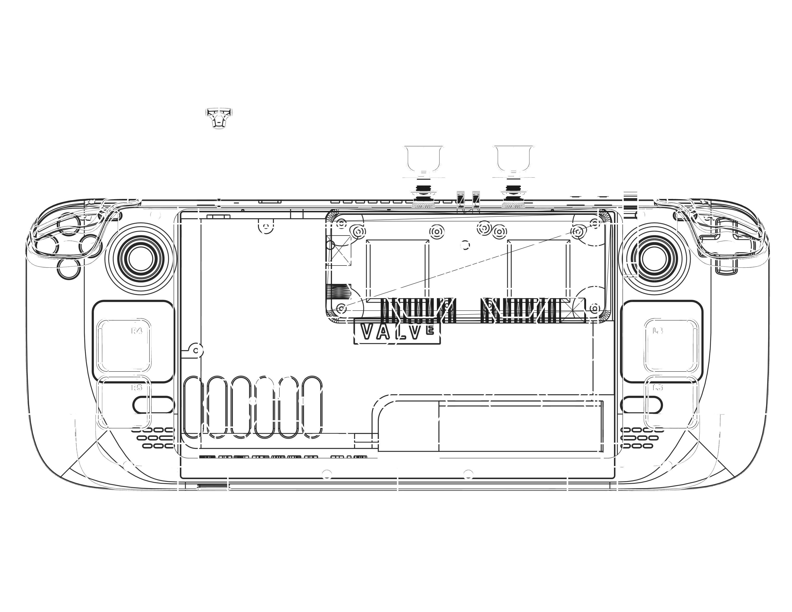

# SkyDeck

The skydeck combines a ground station, rc link, and fpv system in a steam deck to create an efficient and portable way to control ardupilot drones

## RC and Mavlink

RC control and mavlink are both done over a single transmitter using ExpressLRS with the rc-mavlink functionality

// add details on setup

## FPV

To pair with low latency RC control, skydeck uses the Walksnail VRX for video feed. This pairs nicely with an OLED steam deck and allows for manual fpv flying

// add details

## GUI and Input

Mission planner is used as a GCS and can be installed on the steam deck using mono and following these instructions:
https://aur.archlinux.org/packages/ardupilot-mission-planner

Some custom code modified from kkbin505's excellent DIY elrs transmitter code is used to send crsf packets from an ESP32 to the ELRS tx module. This is paired with a python script on the steam deck that sends deck controller output to the ESP32.

## A note on reliability

This project uses a very software heavy approach to allow RC control. As always, set a failsafe before you fly, and follow the local regulations regarding drones.

